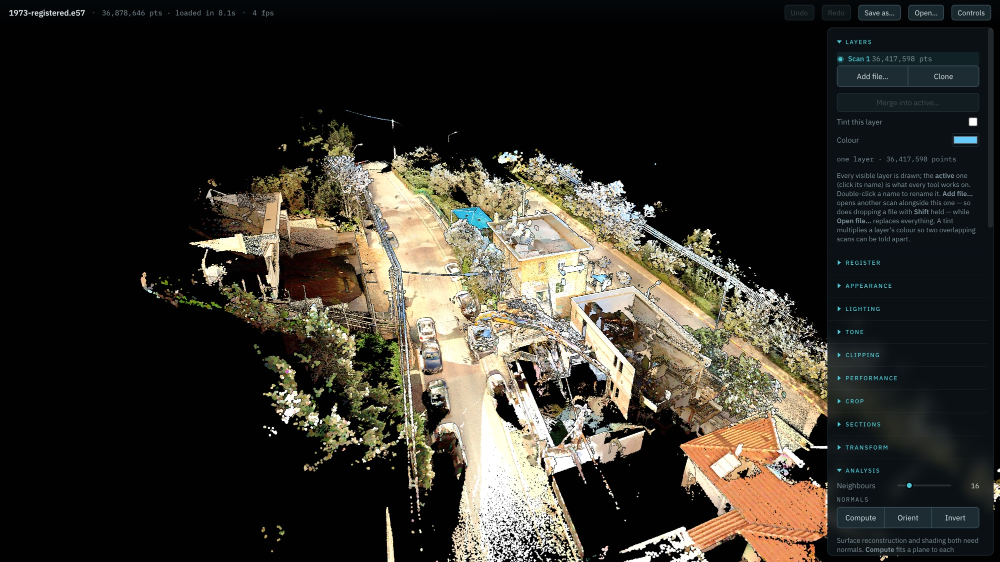
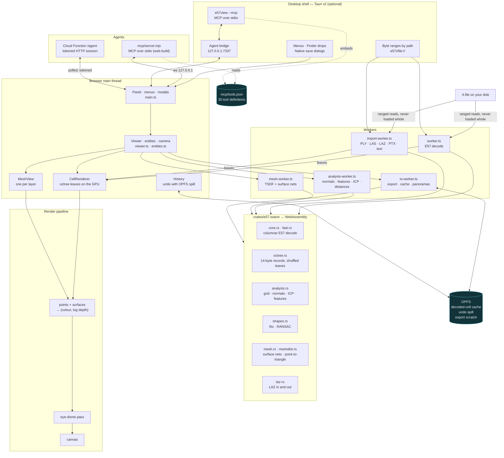

<!-- SPDX-License-Identifier: GPL-3.0-only -->
<h1 align="center">e57view</h1>

<p align="center">
  <strong>Open a 3 GB laser scan in a browser tab. Nothing is uploaded, nothing is installed,
  and it renders like a desktop application.</strong>
</p>

<p align="center">
  <a href="LICENSE"></a>
  <a href=".github/workflows/build.yml"></a>
  <a href="#the-agent-interface"></a>
  <a href="https://opensketch.web.app"></a>
</p>

<p align="center">
  
</p>

<p align="center"><sub>36.9 million points of a 3.23 GB E57, drawn in the browser with eye-dome lighting. The file is still on the disk.</sub></p>

---

e57view reads **E57**, **LAS**, **LAZ**, **PTX**, **PLY** and delimited text point clouds, and
**PLY / OBJ / STL** meshes, and lets you look at them, measure them, clean them, register them,
compare them, reconstruct surfaces from them and write them back out — in a browser tab, or as
a 4.7 MB desktop application that opens no network connection at all.

**Try it:** [opensketch.web.app](https://opensketch.web.app) — drop a file on the page.

## Why this exists

Point cloud software is desktop software with an import step. You install something, you wait
for it to convert your file into its own format, and then you look at your data. That is a long
way to go to answer "how wide is that opening".

The bet was that a browser could skip all of it. It can, and here is what makes it work — every
number below is asserted by a test driver on every run, not remembered:

- **Nothing is uploaded, ever.** The file is read off your disk by a WebAssembly decoder inside
  a worker. There is no server that could receive a scan, and the desktop build opens no
  network connection at all.
- **A 3.23 GB E57 opens in 13.5 seconds** with no import step — 73.8 million points, from a
  columnar decoder written for this project that is four times faster than the reference reader
  and validated bit-exact against it on all ten fields. The file **never enters WebAssembly
  memory**: a synchronous ranged-read shim feeds the Rust reader, so wasm32's 4 GB address
  space is not a ceiling. No SharedArrayBuffer, no cross-origin isolation headers.
- **It renders like a desktop viewer.** A leaf-only octree with 14-byte points, each leaf
  shuffled so drawing a prefix is a uniform subsample — continuous level of detail at no
  storage cost — through a hand-written WebGL2 pipeline with eye-dome lighting. 8M points in
  **9.8 ms**, 32M in **30 ms**.
- **Destructive edits undo**, including a crop of seventy million points, by spilling to
  private browser storage rather than keeping a second copy in memory.
- **Transforms are never baked.** A cloud carries a 4×4 matrix that every consumer reads
  through, so levelling a scan is instant, lossless and undoable, and only a written file bakes
  it.
- **It was built for an AI agent to drive**, not adapted for one afterwards. An orthographic
  render comes back with the mapping that turns any of its pixels into a world point; `probe`
  re-establishes a past render's camera to answer exactly; `recommendedSource` says whether to
  measure the points or the surface and why. 30 MCP tools, offline in the desktop build.
- **Everything is measured.** A unit cube reads 6.000 m² and 1.000 m³. A volume comes out
  **−0.11%** from arithmetic. A cylinder fit lands **0.0000°** off the axis. ICP recovers a
  known offset to **0.000 mm**. Each of those is a driver asserting it, and each caught a real
  bug the day it was written.

For an honest account of what it does *not* do, see
[docs/cloudcompare-gap-analysis.md](docs/cloudcompare-gap-analysis.md) — a capability audit
against CloudCompare read from its source, 190 rows, kept current.

## What it does

<details open>
<summary><strong>Import and export</strong></summary>

| | |
|---|---|
| **E57** | Read and write. The writer keeps colour, intensity and normals with the original pose; an exported E57 re-parses bit-exact. |
| **LAS / LAZ** | Reads 1.2–1.4, writes 1.2. LAZ is decompressed a chunk at a time by laz-rs compiled to WebAssembly, so a multi-gigabyte LAZ never enters wasm memory whole. COPC reads as ordinary LAZ. Classification becomes a scalar field. |
| **PTX** | One cloud with each scan's own transform applied and each scan a station. |
| **PLY** | Points or meshes, ASCII and both binary orders. |
| **Text** | `.txt .xyz .pts .asc .csv .neu`, sniffed for delimiter and columns and confirmed in a dialog over the first rows. |
| **Meshes** | PLY, OBJ and STL in and out. |
| **Vector out** | Contours as DXF (LWPOLYLINE) or GeoJSON; height models as PNG with a world file. |

</details>

<details open>
<summary><strong>Viewing and navigation</strong></summary>

- Seven colour modes: RGB, intensity, RGB × intensity, elevation ramp, normals, scalar field, flat.
- **Eye-dome lighting** with a same-surface tolerance, so close-ups do not ring.
- Adaptive point sizing with a max-pixel clamp, circular points, normal shading.
- Tone controls, an intensity histogram with auto-ranged handles, height clipping.
- Zoom toward the cursor, double-click to move the orbit centre, and a **fly mode**
  (W A S D, Q E, drag to look) for walking inside a building.
- **Panorama stations**: stand inside the scan's own 360° photo with the points blended over it.
- Renders only when something changed; the full budget when idle, a fraction while interacting.
- **Mobile**: a bottom-sheet panel, two-finger pan and pinch, and an azimuth chosen so the
  cloud's long axis runs along the screen's long axis.

</details>

<details open>
<summary><strong>Regions and editing</strong></summary>

- Regions are **box, sphere, slab or prism** — created by pointing at a thing and grown or
  fitted to what they hold, rather than drawn. Any number, unioned.
- A drawn outline becomes a **prism**: a real 3D region you can orbit around and adjust, not a
  one-shot screen-space cut.
- Crop **both ways** — keep what is inside, or remove it — with the preview dimming whichever
  half is going and the confirmation counting both sides.
- **Undo and redo** for every destructive step, with disk spill. **Save as** writes what is in
  memory, crop and transform included, and never touches the original.

</details>

<details open>
<summary><strong>Analysis and scalar fields</strong></summary>

- **Normals**: computed over a neighbourhood, propagated breadth-first, and oriented toward the
  scan's own station positions *per point* — the only orientation that is right for something
  scanned from the inside.
- **Fifteen geometric features** as scalar fields: roughness, curvature, planarity, linearity,
  sphericity, anisotropy, omnivariance, eigenentropy, verticality, volume and surface density,
  neighbour count, and the three eigenvalues.
- **Cleaning**: statistical outlier removal, a local-surface noise filter, duplicate removal,
  spatial subsampling, connected components.
- A field gets a ramp, a histogram, a display range and a value filter that can delete what
  falls outside it in one undoable step.

</details>

<details open>
<summary><strong>Fitting and detection</strong></summary>

- Fit a **plane, sphere, cylinder or circle** to what a region holds — each reporting an
  **RMS**, because a cylinder fitted to a flat wall has a radius and an axis and means nothing
  without one. Validated: plane normal to 0.008°, sphere centre and radius to 0.01 mm, cylinder
  axis to 0.0000°.
- **RANSAC shape detection** over the whole cloud, one shape at a time, removing each shape's
  inliers before looking for the next — which is also the non-maximum suppression. Every point
  gets a *Shape* index as a field.

</details>

<details open>
<summary><strong>Layers, registration and comparison</strong></summary>

- **More than one cloud open at once**, every visible one drawn, exactly one active. Clone,
  merge, tint, rename, hide.
- **Registration**: match centres, match scales, and point-to-plane **ICP** reporting
  per-iteration RMS, overlap, pairs and the matrix.
- **Cloud-to-cloud distance** as a scalar field, optionally signed along the reference's own
  normals so settlement and heave stop cancelling.

</details>

<details open>
<summary><strong>Surfaces and meshes</strong></summary>

- **Surface reconstruction** from oriented points, with a hole ratio so you can tell whether
  the result is worth measuring.
- Meshes are **layers**, every visible one drawn: **area and volume** through the layer's
  transform with the boundary-edge count beside them, **area-weighted point sampling** into a
  new layer, **cloud-to-mesh distance** as a field (point-to-triangle, not
  point-to-nearest-vertex), **flip**, **Taubin smoothing**, and **decimation** by quadric
  vertex clustering.

</details>

<details open>
<summary><strong>Rasters, contours and volumes</strong></summary>

- **Height models** over a regular grid along any axis — highest, lowest, mean, density, or the
  mean of a scalar field — draped over the cloud so they can be judged rather than merely
  produced.
- **Contours** by marching squares with the crossing interpolated along each edge, out as DXF
  or GeoJSON in the global frame.
- **2.5D volumes** against another layer or a flat plane, cut and fill reported separately
  because their sum hides both.

</details>

<details open>
<summary><strong>The agent interface</strong></summary>

- **30 MCP tools** over a localhost bridge — state, calibrated views, sections, probe, contour,
  fit, detect, regions, transform, register, distance, volume, mesh, cache, export, script.
- **A calibrated modelling kit**, not screenshots: every orthographic render returns
  `metresPerPixel` and a `topLeft`, and `probe` turns pixels of a past render back into world
  points exactly.
- **Scripts**: a list of `{cmd, args}` steps run in order with each step's result available to
  the next, because the round trip is the expensive part.
- A **hosted HTTP session** for driving a browser tab from anywhere — opt-in, bearer token,
  read-only by default, revoked when the tab closes.
- [`public/llms.txt`](public/llms.txt) documents the whole surface with worked examples.

</details>

<details open>
<summary><strong>The desktop app</strong></summary>

- **Tauri v2**, 4.7 MB, working with **no network at all**: no analytics, no web fonts, and the
  Firestore client resolved away at build time rather than merely not called.
- Files open **by path** — Finder drops, a File menu with Open Recent, `e57view scan.e57`.
- **Native Save dialogs** for every export.
- **MCP built in**: `e57view --mcp` speaks MCP on stdio with no Node and no install.
- On a 3.23 GB, 73.8M-point E57: **13.0 s to open, 82 MB resident, 0.7 s to reopen from the
  on-device cache**.

</details>

## Architecture



Three things in that diagram are the whole design:

1. **The file is never held.** Every decoder takes a `readRange(offset, length)` callback —
   `FileReaderSync` over `File.slice()` in the browser, a ranged request to the shell in the
   desktop app — so the same code reads a 3 GB file from either.
2. **Points live on the GPU, quantised.** Fourteen bytes each, in leaf cubes, shuffled. Nothing
   holds a second copy: analysis reads leaves back, undo spills to disk, transforms are a
   matrix.
3. **`mcp/tools.json` is the only description of the agent surface.** The Node server reads it;
   the Rust server embeds it; a test asserts both serve exactly it. Two servers describing the
   same tools in two languages would have drifted in a week.

## Quick start

### In a browser

Go to [opensketch.web.app](https://opensketch.web.app) and drop a file on the page. Or run it
yourself:

```sh
npm ci
npm run dev            # http://127.0.0.1:5180
```

Chrome or Edge give you the on-device cache and the file picker that remembers where a file
came from; Firefox and Safari work without those.

### As a desktop app

```sh
npm ci
npm run desktop:build      # → desktop/target/release/bundle/
```

You need [Rust](https://rustup.rs) and, on Linux, `libwebkit2gtk-4.1-dev` and `libgtk-3-dev`.
CI builds macOS, Windows and Linux on every push.

> **Unsigned builds.** Releases are not code-signed yet. macOS will refuse the first open —
> right-click the app and choose *Open*, or run
> `xattr -dr com.apple.quarantine /Applications/e57view.app`. Windows SmartScreen will warn
> once. [`.github/workflows/build.yml`](.github/workflows/build.yml) documents exactly which
> secrets to add to sign and notarise.

### Driving it from an agent

**Claude Code, Cursor, or anything else that speaks MCP — desktop app** (no Node, no network):

```sh
claude mcp add e57view -- "/Applications/e57view.app/Contents/MacOS/e57view" --mcp
```

**Claude Desktop**, in `claude_desktop_config.json`:

```json
{ "mcpServers": { "e57view": {
    "command": "/Applications/e57view.app/Contents/MacOS/e57view",
    "args": ["--mcp"] } } }
```

**Browser build** — one file, Node 20, nothing else:

```sh
curl -fsSL https://opensketch.web.app/mcp.mjs -o e57view-mcp.mjs
claude mcp add e57view -- node "$PWD/e57view-mcp.mjs"
```

then open the viewer and tick **Local MCP** in the Agent panel.

**Over HTTP, no MCP** — press *Copy agent URL* in the Agent panel and POST to the endpoint it
gives you. Read-only until you tick *Allow edits*; the token is shown once and the session dies
with the tab. See [`public/llms.txt`](public/llms.txt).

## Development

```sh
npm ci
npm ci --prefix mcp                                   # only for the Node MCP server
npm run dev                                           # the viewer

npx tsc --noEmit -p tsconfig.json                     # types
npm run build                                         # the web bundle
npm run test:mcp                                      # both MCP servers against mcp/tools.json
cargo run --release --bin anatest \
  --manifest-path crates/e57-wasm/Cargo.toml          # native geometry checks
```

Rebuilding the WebAssembly, only if you change the Rust:

```sh
rustup target add wasm32-unknown-unknown
cargo install wasm-bindgen-cli --version 0.2.128      # must equal the crate version exactly
npm run wasm
```

The browser drivers need the built app being served:

```sh
npm run build && npx vite preview --port 5180 &
node drive-fit.mjs        # and the other thirty drive-*.mjs
```

A few drivers need a real multi-gigabyte scan, which cannot live in this repository. They read
`E57VIEW_TEST_FILE` and skip with an explanation when it is not set.

| | |
|---|---|
| `src/` | the viewer: renderer, workers, UI, agent link |
| `shared/` | code the main thread and the workers both use |
| `crates/e57-wasm/` | Rust: decoding, the octree, analysis, shapes, meshing |
| `desktop/` | the Tauri shell, the agent bridge, the Rust MCP server |
| `mcp/` | `tools.json` and the Node MCP server |
| `functions/` | the Cloud Function behind the hosted agent session |
| `drive-*.mjs` | the drivers |
| `docs/` | the gap analysis |
| [`FINDINGS.md`](FINDINGS.md) | **the engineering log** — what was hard, what was wrong, and the numbers |

`FINDINGS.md` is the most useful file here if you are going to change anything. It is not a
changelog; it is what was tried, what broke, and what the measurements said.

## Deploying the hosted build

This repository's own instance lives at `opensketch.web.app` — *opensketch* is the Firebase
project the maintainer deploys to, and nothing more. To run your own:

```sh
firebase use --add                    # your project
# put your own config in src/firebase-config.ts (it is public web config, not a secret)
npm run build
firebase deploy --only hosting,functions:agent,firestore:rules
```

The only Cloud Function is `agent`, the mailbox that lets an agent drive an open tab. **If you
do not want it, delete it** — the viewer, the local MCP bridge and the desktop app all work
without any Firebase at all, and the desktop build does not even contain the client.

## Contributing

[CONTRIBUTING.md](CONTRIBUTING.md) has the build, the test conventions and the one rule that
matters: **every feature ships with a driver that measures something with a known answer.**

- [Code of Conduct](CODE_OF_CONDUCT.md) — Contributor Covenant 2.1
- [Security](SECURITY.md) — how to report, and the agent endpoint's threat model
- [Changelog](CHANGELOG.md)
- [Third-party licences](THIRD_PARTY.md) — generated, and it fails the build on an
  incompatible one

## Roadmap

From the [gap analysis](docs/cloudcompare-gap-analysis.md), in the order they would change most:

1. **A project file.** Several layers, their transforms, regions and the camera, saved
   together. Almost everything about polylines, labels and reusable sessions waits behind this.
2. **Headless batch.** `e57view --load x.e57 --sor --save y.las` with no display. `script`
   batches work in a live window; there is no way to run without one.
3. **Many scalar fields at once**, with a manager, arithmetic between them and conversion to
   and from colour.
4. **More of the format tail**: GeoTIFF rasters, SHP, mesh formats beyond PLY/OBJ/STL, LAS
   full waveform.
5. **Screened Poisson reconstruction** alongside the current TSDF, which fills gaps more
   aggressively.
6. **Signed release builds** for macOS and Windows.

## Licence

**GPL-3.0-only.** See [LICENSE](LICENSE). Every dependency is compatible; see
[THIRD_PARTY.md](THIRD_PARTY.md), which is generated from the lock files and refuses to
finish if it meets a licence that is not.
